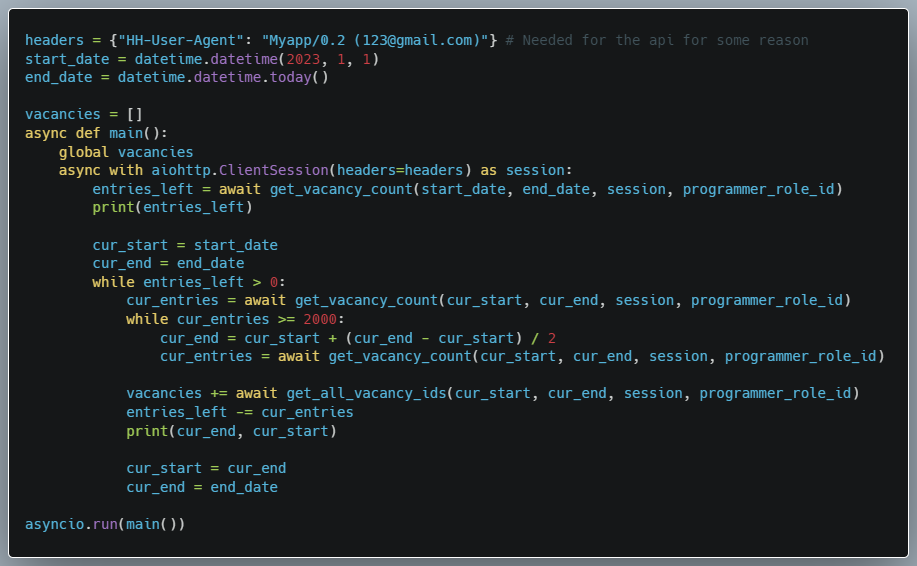
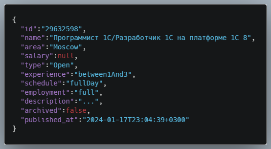

### Introduction

A few days ago, in light of my job seeking anxiety, I started to wonder: What skills are actually in demand for a person (i.e. me) with little to no commercial experience?

The most reliable way is, of course, to parse a bunch of developer job postings and see for myself (and maybe find some other cool trends in swe jobs!).

That's why I decided to start this small project. But let's not dwell to much on my motivations and start to actually do stuff.

### Where are the jobs?

Of course, to analyse job postings, we first need to find them. For that, I've chosen the largest job related service in my country - [HeadHunter](https://hh.ru).

And, fortunately for us, they even have an official [API](https://github.com/hhru/api)!

It seems that this will be quite straightforward, then? Unfortunately, not everything is so simple.

### Actually using the API

I'm won't go too in depth on the intricacies of the API (primarily, because I myself am not that knowledgable about it), so we will focus on two main methods that we will use:
| Method | Url Pattern               | Description                                                       |
|:------:|---------------------------|-------------------------------------------------------------------|
|  GET   | _/vacancies_              | This endpoint gives us the list of vacancies that we want to find |
|  GET   | _/vacancies/{vacancy_id}_ | This endpoint gives us detailed information about a vacancy       |

Everything seems fine, until we read the documentation of _/vacancies_ endpoint:
|  |
| :------------------------------------------------: |
|              _Developers be damned!_               |

Which basically means that we can only fetch 2000 vacancies at most.

You may interject: _"But it says that the restriction only takes effect when using pagination parameters!"_, to which, unfortunately, I have to say that this is a LIE.

Even if you don't specify pagination, it get's implicitly specified for you by the server.

So, how do we get around this?

### The workaround

Thankfully, there is a feature that will save our endeavor: you can specify the time period of the vacancies from _/vacancies_ endpoint.

By using binary search and shrinking the period until we get under 2000 vacancies and then shifting the start of the period forward, we can fetch all of the vacancies we want, essentially sidestepping the limitation (at the cost of some additional requests).

I'm not sure if my explanation was the clearest, but in the end we get the following code:
|        |
| :--------------------------------------------------------: |
| _It may not be the most elegant solution, but it works..._ |

All that's left is to get the detailed descriptions of vacancies by following the ids we just gathered.

### Vacancy data structure

Before we start processing the data, let's see what data we have in our hands.

Here is a sample of our data:

### Actual processing and analysis
To be continued...

