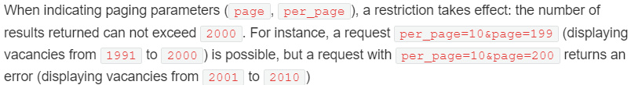
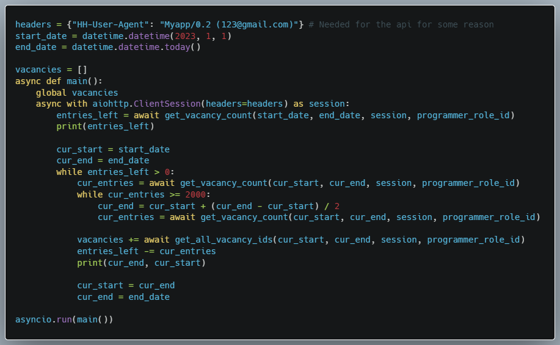
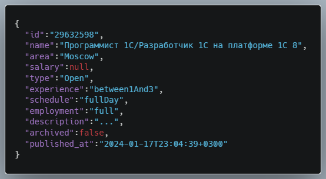
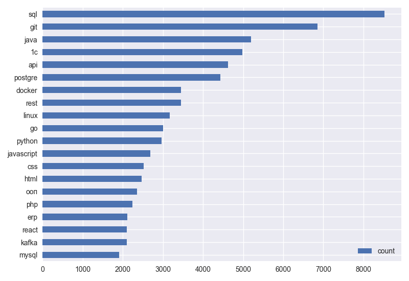
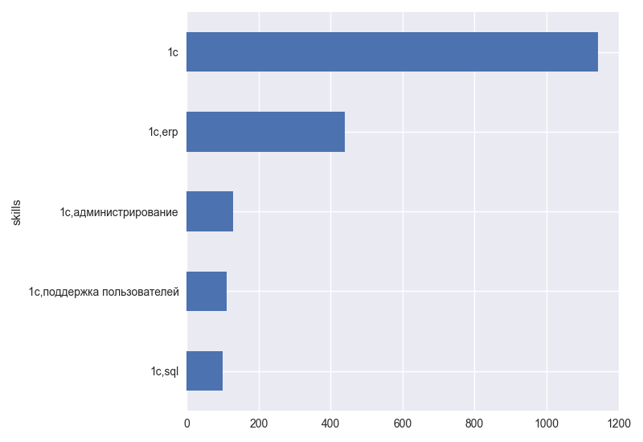
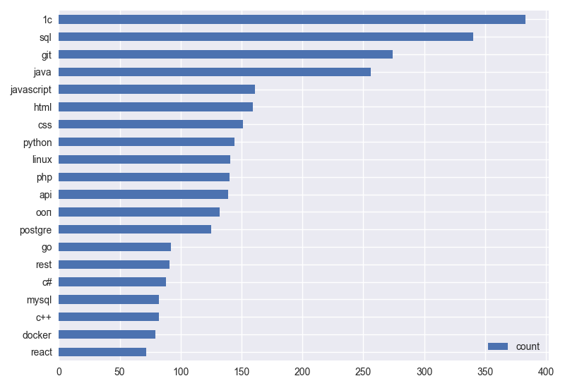

### Introduction

A few days ago, in light of my job seeking anxiety, I started to wonder: What skills are actually in demand for a person (i.e. me) with little to no commercial experience?

The most reliable way is, of course, to parse a bunch of developer job postings and see for myself (and maybe find some other cool trends in swe jobs!).

That's why I decided to start this small project. But let's not dwell to much on my motivations and start to actually do stuff.

### Where are the jobs?

Of course, to analyse job postings, we first need to find them. For that, I've chosen the largest job related service in my country - [HeadHunter](https://hh.ru).

And, fortunately for us, they even have an official [API](https://github.com/hhru/api)!

It seems that this will be quite straightforward, then? Unfortunately, not everything is so simple.

### Actually using the API

I'm won't go too in depth on the intricacies of the API (primarily, because I myself am not that knowledgable about it), so we will focus on two main methods that we will use:
| Method | Url Pattern               | Description                                                       |
|:------:|---------------------------|-------------------------------------------------------------------|
|  GET   | _/vacancies_              | This endpoint gives us the list of vacancies that we want to find |
|  GET   | _/vacancies/{vacancy_id}_ | This endpoint gives us detailed information about a vacancy       |

Everything seems fine, until we read the documentation of _/vacancies_ endpoint:
|  |
| :------------------------------------------------: |
|              _Developers be damned!_               |

Which basically means that we can only fetch 2000 vacancies at most.

You may interject: _"But it says that the restriction only takes effect when using pagination parameters!"_, to which, unfortunately, I have to say that this is a LIE.

Even if you don't specify pagination, it get's implicitly specified for you by the server.

So, how do we get around this?

### The workaround

Thankfully, there is a feature that will save our endeavor: you can specify the time period of the vacancies from _/vacancies_ endpoint.

By using binary search and shrinking the period until we get under 2000 vacancies and then shifting the start of the period forward, we can fetch all of the vacancies we want, essentially sidestepping the limitation (at the cost of some additional requests).

I'm not sure if my explanation was the clearest, but in the end we get the following code:
|        |
| :--------------------------------------------------------: |
| _It may not be the most elegant solution, but it works..._ |

All that's left is to get the detailed descriptions of vacancies by following the ids we just gathered.

### Vacancy data structure

Before we start processing the data, let's see what data we have in our hands.

Here is a sample of our data:

### Actual processing and analysis
I have to preface the following sections with the fact that I know nothing about data analysis and was just curious to see the most popular tech in my job market (to maybe get some insight into what to learn to actually get a job at last).

But how do we get the key skills of a job posting? I decided to go with the most straightforward solution and assemble a list of 100-ish skills and then just match them against posting descriptions.

And while even I know that this method is far from perfect, for the purposes of my little experiment, it will suffice.

Now, to the actual fun stuff (pictures)! 

First, I had to verify the unfortunate aspect of swe jobs - the lack of entry level positions. Which, obviously, holds true for my country as well:

From this chart, we can see that the vast majority of jobs requires either 1 to 3 year of experience or 3 to 6. 
This is, of course, good for people with *some* experience in commercial swe, but for someone like me... it's pretty depressing.

So, now, let's see what skills are in demand among all experience levels:

It seems that SQL is quite popular as a requirement among the postings, along with java... and 1C.

We have to talk about 1C, because it was quite an outlier among other skills.
You see, I also did one more chart for skills, which didn't consider how many postings had a skill in it, but how many postings had the same skill distribution. And the chart was... bewildering for me:

As we can see, there is a **STAGGERING** amount of job postings that **ONLY** require people to have the knowledge of 1C software. 

At first, I thought that this was some kind of mistake on my part, but after checking out a few vacancies, it seems to be true.

Since we want to see what is required of a person with no experience, let's see the skill demands:

They are honestly not entirely different from general ones, aside from a big skew towards 1C jobs, which would make sense, since only people as desperate as interns would work with their software.

And loking at skill groups:

... Yeah, it's the same (not really surprising).

### Conclusion and some thoughts
With the surprising prevalence of java among the no experience job postings, it seems to be a decent choice of a language to learn, along with basics like SQL and Git.

To be honest, not very surprising, since I saw a this stuff a lot in job postings regardless.

On the further note, it would be more interesting to see the distribution of skills on **APPLICATION(RESUMES)** and then correlate them with the figures we got for job postings. It may give some rough estimate of jobs that have a lot of demand, but not a lot of supply (I would guess they are mostly 1C related...)

But I've grown a bit tired of this small project for now (and have other stuff to do), so maybe I will do this in the future.
